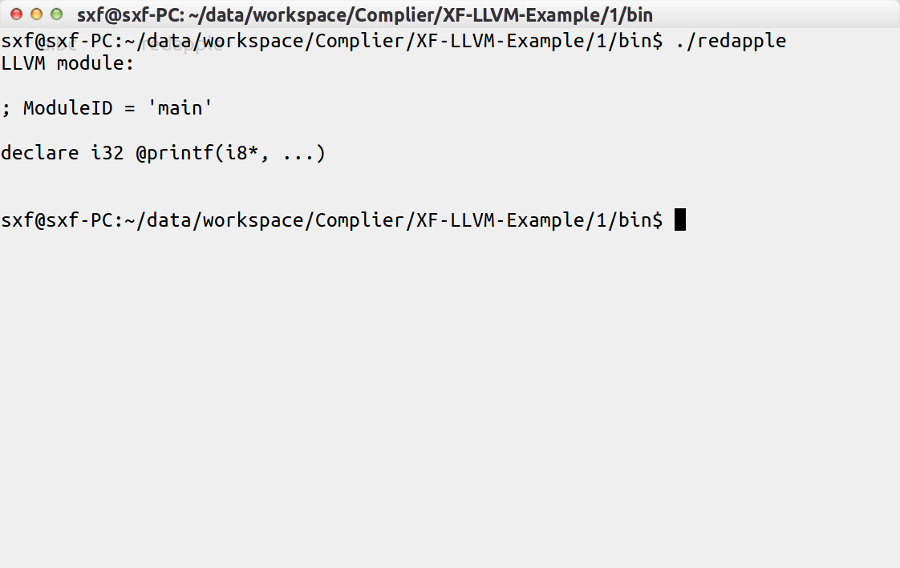

title: 编译器架构的王者LLVM——（3）用代码生成代码
---

LLVM平台，短短几年间，改变了众多编程语言的走向，也催生了一大批具有特色的编程语言的出现，不愧为编译器架构的王者，也荣获2012年ACM软件系统奖 —— 题记

版权声明：本文为 西风逍遥游 原创文章，转载请注明出处 西风世界 http://blog.csdn.net/xfxyy_sxfancy

## 用代码生成代码

LLVM的开发思路很简单，就是用C++代码去不断生成llvm字节码。

### RedApple语言示例

这是我花了两周多的时间制作的一门实验型语言，主要是想验证一个编译器的设计思路，宏翻译系统。
它的架构和一般的编译器很不一样，首先，编译器前端会先将语法转换为很通用的AST语法树节点，一般的编译器，往往是直接在这些节点上进行语义分析，然后进行代码生成。
这次我采用了类似lisp的表示方法，将源文件转换为语法树，然后遍历整棵语法树，根据上面标注的宏提示，去按照各个宏的规则进行翻译工作。

整个编译器1500行左右的代码，非常的小巧，不过功能也比较有限，而且好多地方还不完善，主要支持的就是函数的定义，结构体的定义，函数调用，结构体访问，分配内存，基本逻辑控制语句这些基本的特性。

大家可以作为学习llvm的一个示例吧。
Github地址：[https://github.com/sunxfancy/RedApple](https://github.com/sunxfancy/RedApple)

同样，非常精品的示例还推荐大家看以下两位网友写的：

构建Toy编译器：基于Flex、Bison和LLVM
http://lesliezhu.github.io/public/write-your-toy-compiler.html

用LLVM来开发自己的编译器系列
http://my.oschina.net/linlifeng/blog/97457

当然，这些示例不是说要大家一下都看懂，那么也就没有教程的意义了，下面我会继续介绍各个关键的LLVM平台API以及相关工具链。大家可以将以上三个项目和LLVM官网example中的作为参考，在实践中加以印证。

### 工具链简介

| 工具 | 功能 |
| ---- | ---- |
| clang -emit-llvm | 指令，可以生成.bc的字节码文件 |
| lli  |  llvm解释器，直接执行.bc字节码文件 |
| llc  |  llvm编译器，将.bc编译成.o |

以上三个最常用，其他小工具备用

| 工具 | 功能 |
| ---- | ---- |
| llvm-as  | 汇编器 |
| llvm-dis | 反汇编器 |
| llvm-ar  |  打包器 |
| llvm-link | 字节码链接器 |

唉，太多了，好多我也木有用过，还有需要的请查看官方文档：
http://llvm.org/docs/CommandGuide/index.html


### 常用类

| LLVM类 | 功能 |
| ---- | ---- |
| LLVMContext | 上下文类，基本是最核心的保存上下文符号的类 |
| Module |      模块类，一般一个文件是一个模块，里面有函数列表和全局变量表 |
| Function |	函数类，函数类，生成出来就是一个C函数 |
| Constant |    常量类，各种常量的定义，都是从这里派生出来的 |
| Value | 	    各值类型的基类，几乎所以的函数、常量、变量、表达式，都可以转换成Value型 |
| Type |        类型类，表示各种内部类型或用户类型，每一个Value都有个getType方法来获取其类型。 |
| BasicBlock |  基本块，一般是表示一个标签，注意这个块不是嵌套形式的结构，而是每个块结尾可以用指令跳转 到其他块，类似C语言中的标签的功能 |

### 尝试先来生成个小函数

就拿printf开练吧，这个函数第一有用，第二简单，第三只要声明不要内容。

```cpp
void register_printf(llvm::Module *module) {
    std::vector<llvm::Type*> printf_arg_types; // 这里是参数表
    printf_arg_types.push_back(llvm::Type::getInt8PtrTy(module->getContext()));

    llvm::FunctionType* printf_type =
        llvm::FunctionType::get(
            llvm::Type::getInt32Ty(module->getContext()), printf_arg_types, true); 
            // 这里的true表示后面接不定参数

    llvm::Function *func = llvm::Function::Create(
                printf_type, llvm::Function::ExternalLinkage,
                llvm::Twine("printf"),
                module
           );
    func->setCallingConv(llvm::CallingConv::C); // 一定注意调用方式的正确性
}
```

怎么样，是不是也很简单？

### 编写主函数和调试上下文

下面我们来编写一个主函数，来测试一下我们的函数是否正确，这里，也是LLVM最核心的启动和调试流程。

```
int main(){
	InitializeNativeTarget();
    LLVMContext Context;
    Module* M = new Module("main", Context);

    register_printf(M);

    // 校验问题, 这个函数需要一个输出流来打印错误信息
	if (verifyModule(*M, &errs())) {
		errs() << "构建LLVM字节码出错!\n";
		exit(1);
	}

	// 输出llvm字节码
	outs() << "LLVM module:\n\n" << *M;
    outs() << "\n\n";
    outs().flush();

    // 输出二进制BitCode到.bc文件
	std::error_code ErrInfo;
	raw_ostream *out = new raw_fd_ostream("a.bc", ErrInfo, sys::fs::F_None);
	WriteBitcodeToFile(M, *out);
	out->flush(); delete out;

	// 关闭LLVM释放内存
	llvm_shutdown();
    return 0;
}
```

运行效果：



对了，我们好像没有提该引用哪些头文件，请见附录

### 附：完整示例

只是头文件有点长，具体功能有的我也记不清了，一般我是习惯性把一片粘过去 →_→

```cpp

/* 
* @Author: sxf
* @Date:   2015-11-06 20:37:15
* @Last Modified by:   sxf
* @Last Modified time: 2015-11-06 20:46:43
*/

#include "llvm/IR/Verifier.h"
#include "llvm/ExecutionEngine/GenericValue.h"
#include "llvm/ExecutionEngine/Interpreter.h"
#include "llvm/IR/Constants.h"
#include "llvm/IR/DerivedTypes.h"
#include "llvm/IR/Instructions.h"
#include "llvm/IR/LLVMContext.h"
#include "llvm/IR/Module.h"
#include "llvm/IR/IRBuilder.h"
#include "llvm/Support/ManagedStatic.h"
#include "llvm/Support/TargetSelect.h"
#include "llvm/Support/raw_ostream.h"
#include "llvm/Bitcode/ReaderWriter.h"
#include "llvm/Support/FileSystem.h"
#include "llvm/IR/ValueSymbolTable.h"

using namespace llvm;

void register_printf(llvm::Module *module) {
    std::vector<llvm::Type*> printf_arg_types;
    printf_arg_types.push_back(llvm::Type::getInt8PtrTy(module->getContext()));

    llvm::FunctionType* printf_type =
        llvm::FunctionType::get(
            llvm::Type::getInt32Ty(module->getContext()), printf_arg_types, true);

    llvm::Function *func = llvm::Function::Create(
                printf_type, llvm::Function::ExternalLinkage,
                llvm::Twine("printf"),
                module
           );
    func->setCallingConv(llvm::CallingConv::C);
}


int main(){
	InitializeNativeTarget();
    LLVMContext Context;
    Module* M = new Module("main", Context);

    register_printf(M);

    // 校验问题, 这个函数需要一个输出流来打印错误信息
	if (verifyModule(*M, &errs())) {
		errs() << "构建LLVM字节码出错!\n";
		exit(1);
	}

	// 输出llvm字节码
	outs() << "LLVM module:\n\n" << *M;
    outs() << "\n\n";
    outs().flush();

    // 输出二进制BitCode到.bc文件
	std::error_code ErrInfo;
	raw_ostream *out = new raw_fd_ostream("a.bc", ErrInfo, sys::fs::F_None);
	WriteBitcodeToFile(M, *out);
	out->flush(); delete out;

	// 关闭LLVM释放内存
	llvm_shutdown();
    return 0;
}

```